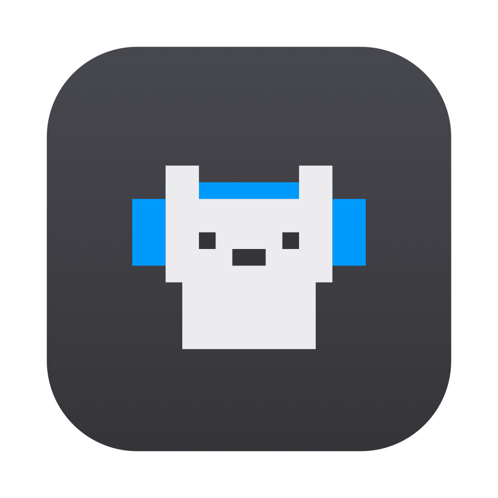
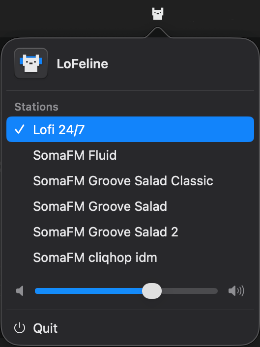

# LoFeline

<p align="left">
  
</p>

A pixel cat that naps in your macOS menu bar. Click it for lofi beats, click
again for silence. Right click for the station list and a volume slider.

The player opens on **Lofi 24/7** and also carries a handful of
[SomaFM](https://somafm.com) channels. Remember to support them!



## Requirements

macOS 14.6 or later.

## Install

```sh
brew install --cask anttiak/tap/lofeline
```

## Usage

Left click starts and stops playback. Right click (or control-click) opens the
menu with the station list, a volume slider, and
quit.

## Stations

| Station | Sound |
|---|---|
| Lofi 24/7 | Round-the-clock lofi hiphop beats |
| Fluid | Instrumental hip-hop, future soul, liquid trap |
| Groove Salad Classic | The original chilled ambient beats and grooves |
| Groove Salad | Chilled ambient beats and grooves |
| Groove Salad 2 | More chilled beats and grooves |
| cliqhop idm | Blips and bleeps backed by beats |

## Build from source

Clone the repo, open `LoFeline.xcodeproj` in Xcode, and run (⌘R).

## License

MIT. See [LICENSE](LICENSE).
